# EventConnect

EventConnect is a platform for event hosts to find caterers, NGOs, and manage event logistics, food prediction, and bookings. The app connects organizers, caterers, and NGOs for seamless event management.

## Visual Showcase

### Organizer Experience
| Profile Management | Create Event | My Events |
| :---: | :---: | :---: |
| 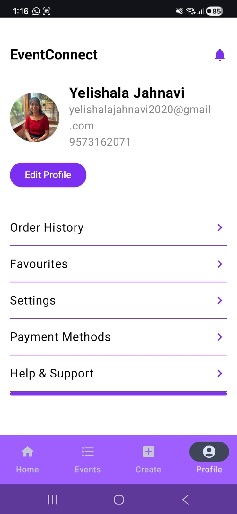 | 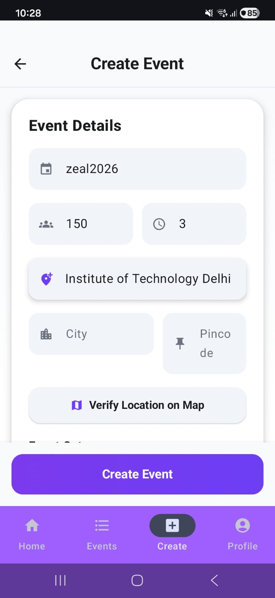 | 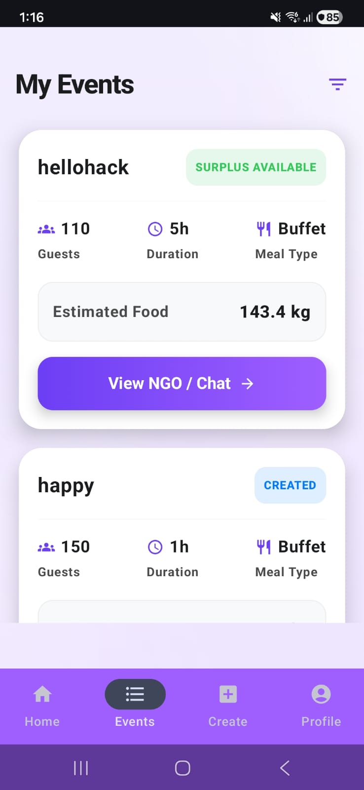 |

| Sending Requests | Booking Status |
| :---: | :---: |
| 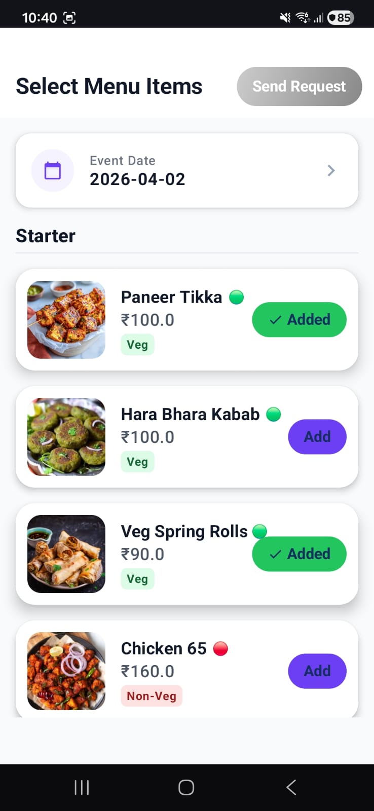 | 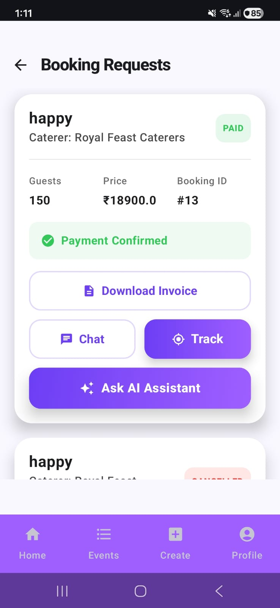 |

### Caterer Experience
| Dashboard | Menu Management | Booking Requests |
| :---: | :---: | :---: |
| 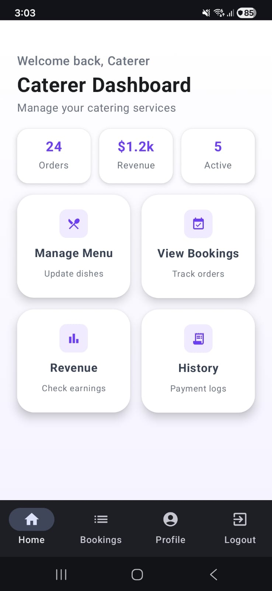 | 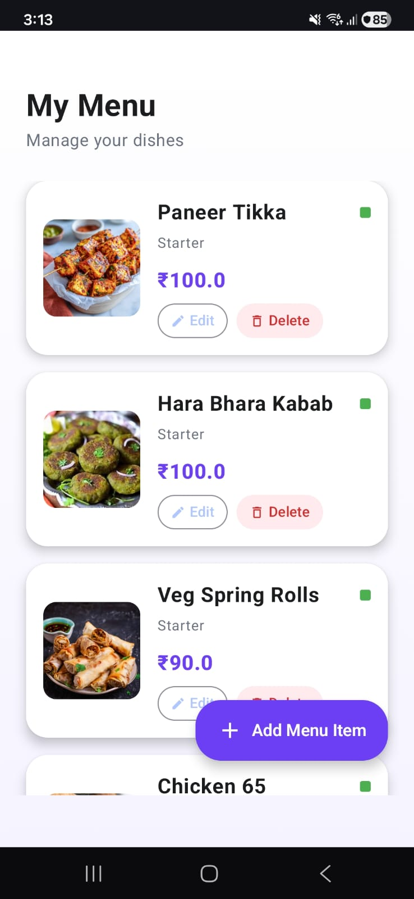 | 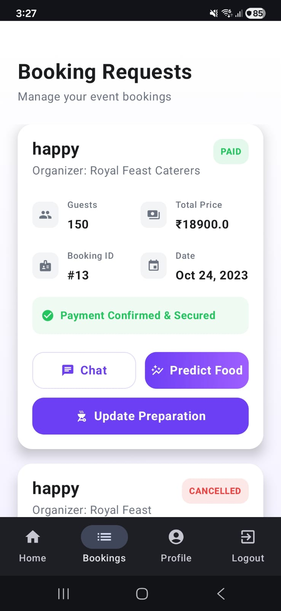 |

| Revenue Insights | Payment History |
| :---: | :---: |
| 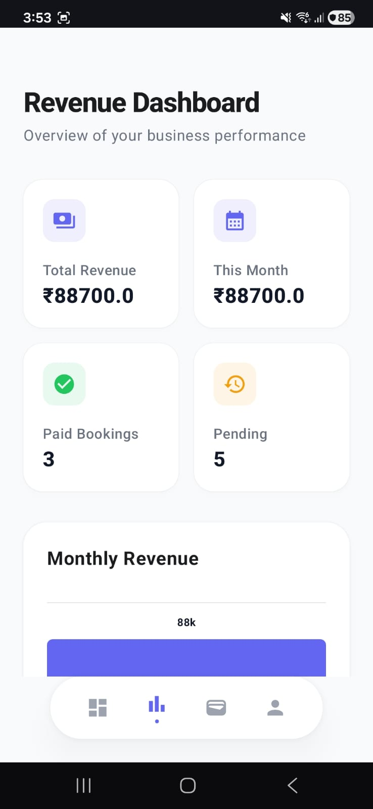 | 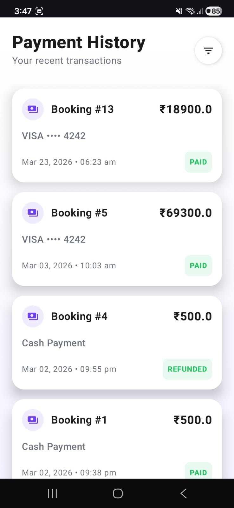 |

### Preparation & Communication
| Update Status | Track Preparation | Real-time Chat |
| :---: | :---: | :---: |
| 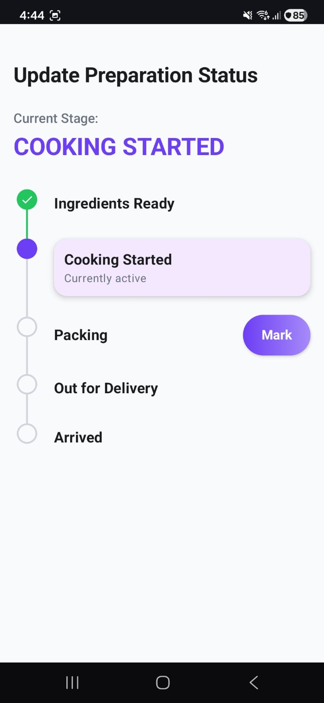 | 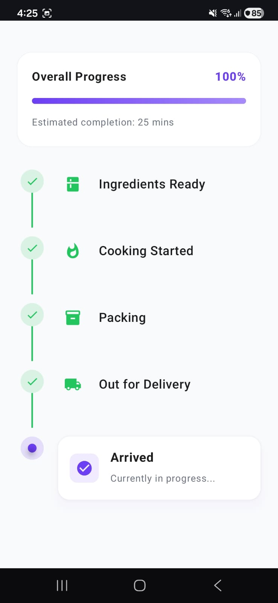 | 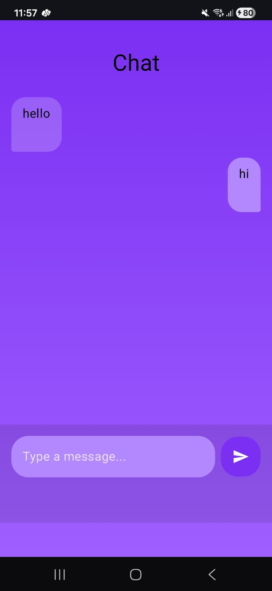 |

### NGO & Surplus Food System
| Sending Alerts | NGO Matching |
| :---: | :---: |
| 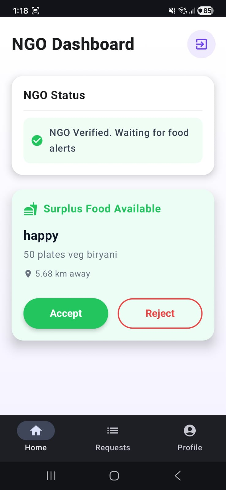 | 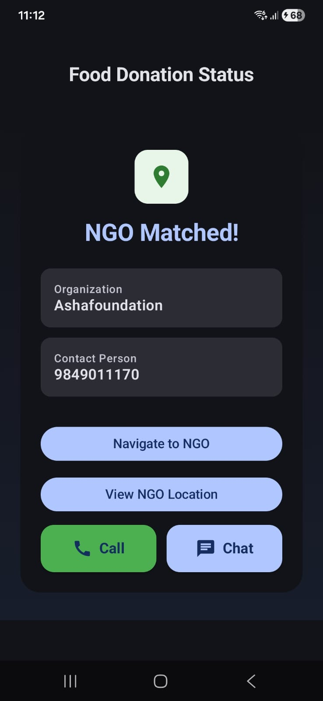 |

| Accepted Requests | Navigation Route |
| :---: | :---: |
| 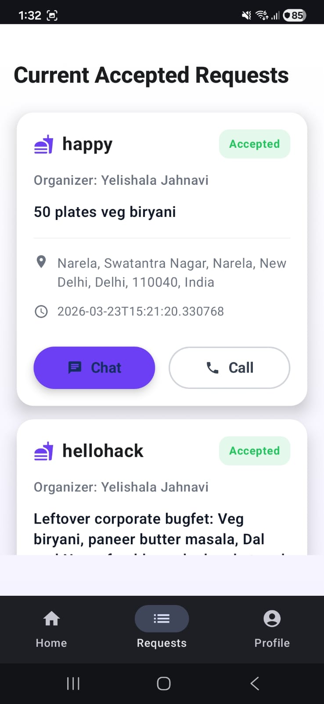 | 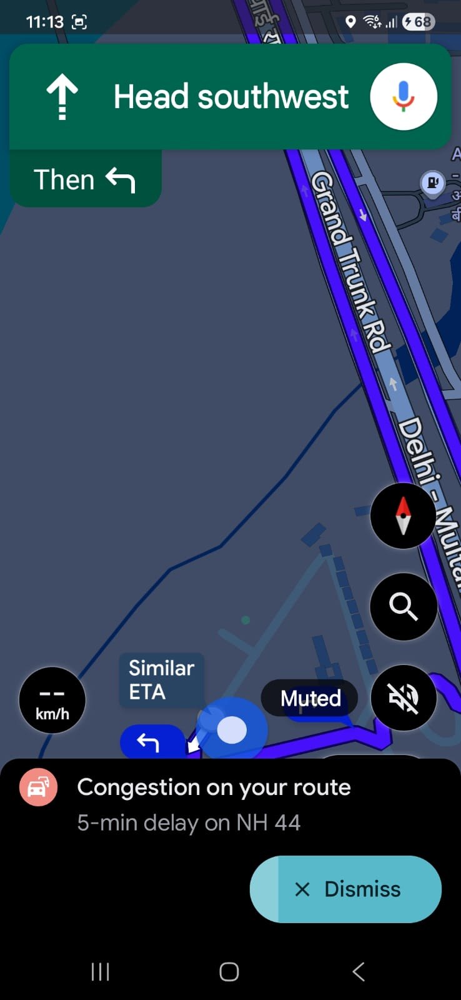 |

### AI Features
| AI Assistant | Food Quantity Prediction |
| :---: | :---: |
| 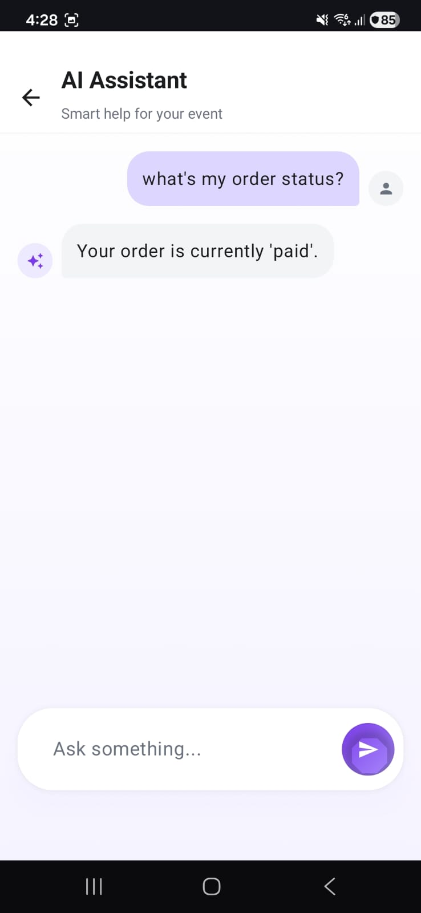 | 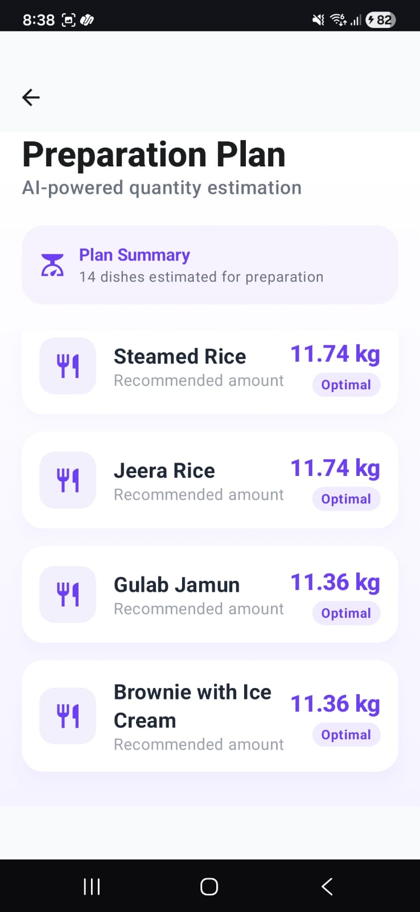 |

### Authentication
| Forgot Password | Email Confirmation |
| :---: | :---: |
| 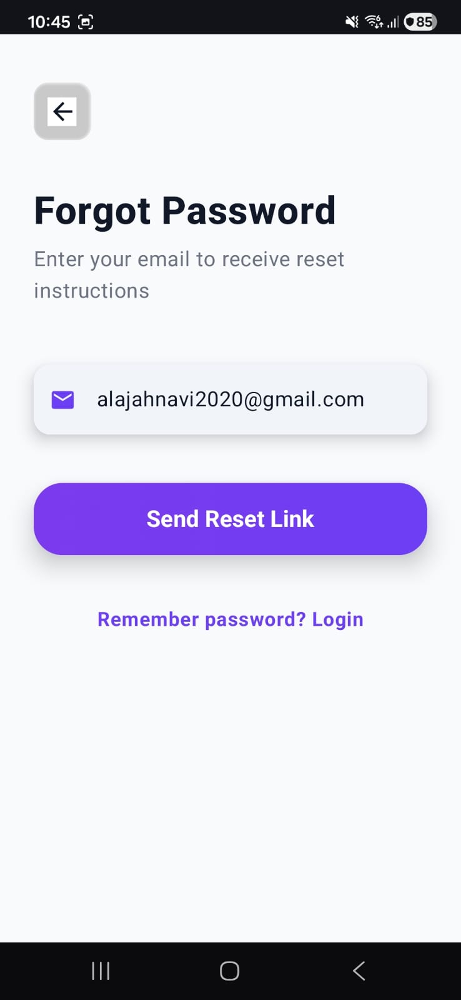 | 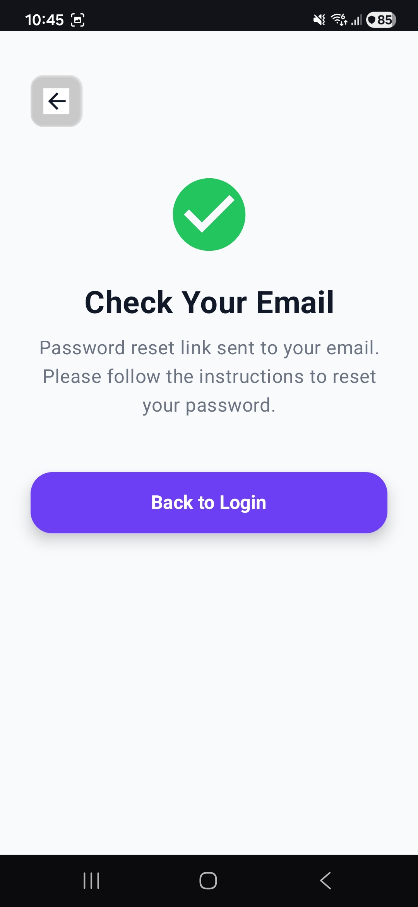 |

## Features

- User authentication (Signup/Login)
- Organizer dashboard: create/manage events, find caterers, book services
- Caterer dashboard: profile management, service listing, booking management
- NGO dashboard: registration, document upload, event participation
- Food prediction: AI-powered food quantity estimation
- Real-time chat between organizers and caterers
- Booking management and payment
- Preparation tracking for caterers
- Surplus food alert system for NGOs
- AI-powered chat assistant

## API Endpoints

### Authentication
- `POST /api/users/signup` — Register a new user
- `POST /api/users/login` — Login user
- `POST /api/users/select-role` — Select user role (organizer/caterer/ngo)
- `POST /api/users/save-fcm-token` — Save FCM token for notifications

### Organizer APIs
- `GET /api/organizers/profile` — Get organizer profile
- `POST /api/organizers/profile` — Create organizer profile
- `PUT /api/organizers/profile` — Update organizer profile
- `POST /api/organizers/upload-image` — Upload organizer profile image
- `POST /api/events` — Create a new event
- `GET /api/events/my-events` — Get organizer's events
- `GET /api/events/{eventId}` — Get specific event details
- `PATCH /api/events/{eventId}/complete` — Complete an event
- `GET /api/caterers/match/{eventId}` — Find matching caterers for event

### Caterer APIs
- `GET /api/caterers/profile` — Get caterer profile
- `POST /api/caterers/profile` — Create caterer profile
- `PUT /api/caterers/profile/me` — Update caterer profile
- `POST /api/caterers/upload-image` — Upload caterer profile image

### Menu APIs
- `GET /api/menus/me` — Get current caterer's menu
- `GET /api/menus/{catererId}` — Get specific caterer's menu
- `POST /api/menus/` — Create a new menu item
- `PUT /api/menus/{menuId}` — Update menu item
- `DELETE /api/menus/{menuId}` — Delete menu item
- `POST /api/menus/upload-image` — Upload menu item image

### Booking & Preparation APIs
- `POST /api/bookings/request` — Create a booking request
- `GET /api/bookings/organizer` — Get bookings for organizer
- `GET /api/bookings/caterer` — Get bookings for caterer
- `GET /api/bookings/{bookingId}` — Get booking details
- `PUT /api/bookings/{bookingId}/status` — Update booking status (accept/reject)
- `PUT /api/bookings/{booking_id}/cancel` — Cancel a booking
- `PUT /api/bookings/{bookingId}/preparation-status` — Update food preparation status
- `GET /api/bookings/{bookingId}/preparation-status` — Get food preparation status

### Payment APIs
- `POST /api/payments/create-checkout-session/{bookingId}` — Create Stripe checkout session
- `POST /api/payments/success/{bookingId}` — Handle successful payment
- `GET /api/payments/{bookingId}` — Get payment details
- `GET /api/payments/caterer/history` — Get caterer payment history
- `GET /api/bookings/caterer/revenue` — Get caterer revenue stats
- `POST /api/payments/refund/{bookingId}` Process refund
- `GET /api/payments/invoice/{booking_id}` — Download payment invoice

### NGO APIs
- `POST /api/ngos/register` — Register NGO
- `GET /api/ngos/me` — Get current NGO registration info
- `GET /api/ngos/documents` — Get NGO uploaded documents
- `GET /api/ngos/documents/status` — Get NGO document verification status
- `POST /api/ngos/upload-image` — Upload NGO profile image
- `POST /api/ngos/profile` — Save NGO profile details
- `GET /api/ngos/profile` — Get NGO profile details
- `PUT /api/ngos/profile` — Update NGO profile details

### Surplus Food APIs
- `POST /api/surplus/send-alert` — Send surplus food alert to nearby NGOs
- `POST /api/surplus/{requestId}/accept` — NGO accepts surplus food request
- `POST /api/surplus/{requestId}/reject` — NGO rejects surplus food request
- `GET /api/surplus/{requestId}/accepted-ngo` — Get info of NGO that accepted
- `GET /api/surplus/{requestId}/nearby-ngos` — Get list of nearby NGOs for an alert
- `GET /api/surplus/my-accepted` — Get NGO's accepted alerts
- `GET /api/surplus/{requestId}` — Get location of surplus food

### Admin APIs
- `GET /api/admin/ngos` — List all NGOs for verification
- `PATCH /api/admin/ngos/{ngoId}/verify` — Verify an NGO
- `PATCH /api/admin/ngos/{ngoId}/reject` — Reject an NGO registration
- `PATCH /api/admin/ngos/{ngoId}/suspend` — Suspend an NGO account
- `PATCH /api/admin/documents/{docId}/approve` — Approve specific NGO document
- `PATCH /api/admin/documents/{docId}/reject` — Reject specific NGO document

### AI & Chat APIs
- `GET /api/chat/{requestId}` — Get chat history for a request
- `POST /api/chat/ai-assistant` — Interact with AI event assistant
- `POST /api/predict-food/` — AI-powered food quantity prediction

## Technology Stack

- **Frontend:** Android (Jetpack Compose)
- **Backend:** FastAPI (Python)
- **Database:** PostgreSQL
- **Cloud Storage:** Cloudinary (for images)
- **Authentication:** Firebase Auth
- **AI/ML:** Gemini API / Custom Food prediction model
- **Payments:** Stripe

## Setup Instructions

1. Clone the repository
2. Configure Firebase and Cloudinary keys in backend
3. Run backend server (FastAPI)
4. Build and run Android app

## Contributors
- Jahnavi Yelishala

## License
MIT
